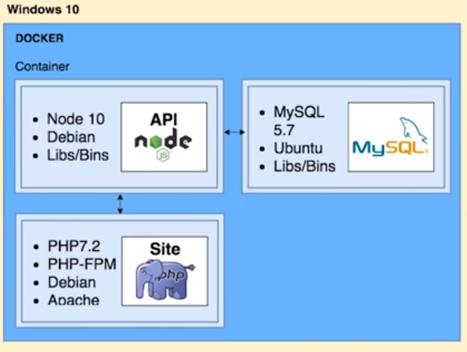

# Docker
- Veio para resolver o famoso problemas: "**No meu computador não funciona**"
- Faz ***containers*** que levam configurações de um computador a outro, aí se tu roda o docker seu computador ficara *"igual"* ao do seu coleguinha.
- Isola sua aplicação em um container virtual.
- Neles se dirá, por exemplo:
    - Bibliotecas da linguagem, a versão
    - O sistema operacional que melhor se adequa, de preferencia qual distribuição linux
    - exemplo em imgem de vários container que não interferem um no outro:
    
    - Se define as configurações no universo docker, e essas configurações se chama imagem, com uma imgem docker se pode passar para qualquer outra pessoa para ela ter a mesma imgem das suas configurações e rodar liso em seu computador, se define o sistema operacional, dependencias e regras
- superior a Maquinas virtuais pois nelas há muito disperdício de recursos operacionais, o docker aproveita muito melhor os recursos, utiliza menos memória e armanezamento.

## Passo a passo
Se cria o Dockerfile onde estram as informações do docker
No caso criamos o Dockerfile com o código interno:
```ts
FROM mysql
ENV MYSQL_ROOT_PASSWORD programadorabordo
```
E então rodamos no terminal `docker build` para ***gerar a imagem**:
```
docker build -t mysql-image -f api/db/Dockerfile .
```
-t: significa "tag" e que estamos dando um nome para a nossa imagem e podemos escolhe-lo

-f: especifica o arquivo Dockerfile escolhido para gerar a imagem

. no final: especifica o local de contexto para gerar a imagem, a imagem estará sendo construida na pasta "."

**Para ver as imagens disponíveis para uso:**
```
docker image ls
```

E então rodamos no terminal `docker run` para ***gerar o container**::
```
docker run -d --rm --name mysql-container mysql-image
```

-d: detash, que é separar, significa que executaremos em background, ou seja, nosso terminal não ficara preso na exibição de informações que o container disponibiliza

--rm: se um container já existir ele será removido para um novo ser criado

--name: dizemos como iremos chamar o container, escolhermos "mysql-container"

**Descobrir os containers que estão ativos:**
```
docker ps
```

**Para executar comandos dentro de um container que está rodando:**
```
docker exec -i mysql-container mysql -uroot -pprogramadorabordo < api/db/script.sql
```

-i: o comando será executado de forma interativa, significa que o processo não será finalizado até que o sql leia todo o arquivo

"mysql-container" após -i : o nome do container que vamos utilizar

Após o nome do container: o comando que queremos executar

    No comando mysql:

    -u: significa qual usuario utilizara o banco, no caso o root
    -p: o password do usuário para conexão no banco
    < script: para especificar o local do script

#### Acessar o container para visalizar a tabela criada:
```
docker exec -it mysql-container  /bin/bash
```

-it: seria a flag -i e a flag -t, a qual significa que utilizaremos o tty, que significa terminal do container
-bin/bash: uitilizaremos o terminal bash

Para acessar o banco:
```
mysql -uroot -pprogramadorabordo
```
Agora uma coisa importante:
### No container, tudo que se faz dentro dele é perdido quando ele é "parado"
- Muitas vezes isso não é o desejado
## Resolução
- Trabalhar com **volumes**

Para isso vamos parar o container:
`exit` para sair do terminal do container

```
docker stop mysql-container
```
- para  parar o container

### Iniciaremos o container com uma tag a mais: -v
```
docker run -d -v $(pwd)/docker/api/db/data:/var/lib/mysql --rm --name mysql-container mysql-image
```

-v : volume, informa a pasta do host que estará compartilhado com o container
-(pwd): retorna o diretório atual
/var/lib/mysql: é a pasta onde fica o mysql e toda a estrutura do banco

Agora rodar de novo o comando do mysql

## Para acesar uma porta do container fora do container (no nosso computador, um localhost)
```
docker run -d -v $(pwd)/docker/api:/home/node/app -p 9001:9001 --rm --name node-container node-image
```
-p: flag dizer que a porta 9001 do nosso hosta acessará a posta 9001 do container.